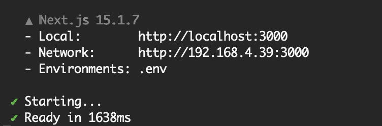
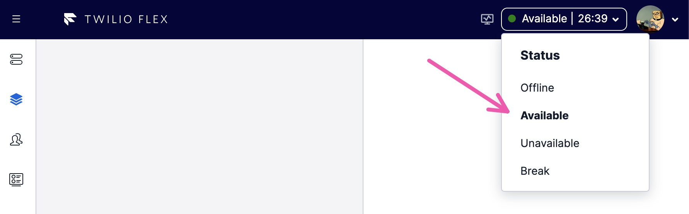

# Twilio Agentic Voice Assistant

A demonstration implementation of an AI-driven voice agent built on [Twilio Conversation Relay](https://www.twilio.com/docs/voice/twiml/connect/conversationrelay).

## Feature Summary

- **Advanced Conversational AI**: Build sophisticated voice agents powered by your LLM of choice
- **Contextual Understanding**: Dynamic resolver leverages structured data to personalize conversations
- **Human in the Loop**: Transfer to agent and ask agent questions capabilities
- **Agentic System**: Architecture supporting multiple coordinated LLMs for different functions
- **Interruptions**: Natural barge-in capability for realistic conversations
- **Voice Intelligence**: Real-time transcription, summarization, and topic extraction
- **Governance & Compliance**: AI supervisor for procedure tracking and conversation monitoring
- **Flexible Architecture**: Modular design with Express and TypeScript for easy customization
- **Debugging User Interface**: A user interface allows you to see what's happening behind the scenes.

## Getting Started

### Step 0: Prerequisites

#### Obtain Twilio Flex Account

This repo demonstrates how to facilitate realtime communication between an AI assistant and a contact center agent. This is possible with many contact center applications. This one happens to use [Twilio Flex](https://www.twilio.com/en-us/flex).

You will need to create (recommended) or use an existing Twilio Flex Account. You can create a trial account here: [Create a new Flex account](https://www.twilio.com/console/projects/create?g=/console/flex/setup).

#### OpenAI Account and API Key

This project uses OpenAI's GPT models to power the AI assistant's conversations. You can get an API key here: [OpenAI API Keys](https://platform.openai.com/api-keys)

#### Ngrok Domain

To run this project locally, you need a publicly accessible URL for Twilio's webhooks. We use ngrok for this purpose. While you can use a dynamic ngrok URL, we recommend using their free static domains to avoid constantly updating webhook URLs.

1. Get your free static domain: https://ngrok.com/blog-post/free-static-domains-ngrok-users
2. Make note of your domain (e.g., your-domain.ngrok-free.app) for the `HOSTNAME` environment variable

### Step 1: Initial Setup

```bash
# install deps
npm install
cd ui && npm install
cd ..

# setup .env files
cp .env.example .env
cp ui/.env.example ui/.env
```

### Step 2: Populate Required Env Variables

```bash
# Your ngrok or server hostname, e.g. 123.ngrok.app
# nGrok provides free static domains: https://ngrok.com/blog-post/free-static-domains-ngrok-users
HOSTNAME=
TWILIO_ACCOUNT_SID=
TWILIO_AUTH_TOKEN= # The Twilio auth token is only required to run setup script and it's only used to generate TWILIO_API_KEY & TWILIO_API_SECRET. If you provide the key/secret, then the auth token is is not required.
OPENAI_API_KEY=
```

### Step 3: Run Setup Script

This application comes with a setup script that automatically configures your Twilio account. The script is intelligent - it only creates resources when needed, checking for undefined environment variables before taking action. You can set specific variables manually and let the script handle the rest.

```bash
npm run setup
```

Or, you can run the setup script for each individually. Note, you must have the `TWILIO_API_KEY` and `TWILIO_API_SECRET` variables defined to run most of these.

```bash
npm run setup:apikey
npm run setup:sync
npm run setup:info
npm run setup:phone
npm run setup:vi
npm run setup:flex
```

### Step 4: Start

Open 2-3 terminal windows:

- 2 required: one for the server, one for the nGrok tunnel
- 1 optional (but recommended): for the UI

#### Terminal 1: Server

```bash
npm run dev
```

#### Terminal 2: nGrok

```bash
npm run grok
```

Note: The script uses the `HOSTNAME` env var as the ngrok private domain.

#### Terminal 3: UI (optional)

```bash
npm run ui
```



### Step 5: Try It

- The UI is running on http://localhost:3000/
- [Open your Flex agent view](https://www.twilio.com/console/flex/service-login) to respond to the bot when it has questions. _Don't forget to set your status to "Available"_
  

- Then call the `DEFAULT_TWILIO_NUMBER`

### What the Setup Script Does

Here's what the script does:

- Create [Twilio API Key & Token](https://www.twilio.com/docs/iam/api-keys)
- Create [Twilio Sync Service](https://www.twilio.com/docs/sync)
- Configure Sync Service webhook url
- Populate the personalization env vars: `DEVELOPERS_EMAIL`, `DEVELOPERS_PHONE_NUMBER`, `DEVELOPERS_FIRST_NAME`, `DEVELOPERS_LAST_NAME`
  - These are only used to demonstrate personalization.
- Purchase a Twilio Phone Number, if `DEFAULT_TWILIO_NUMBER` is undefined
- Configure the [voice webhooks](https://www.twilio.com/docs/usage/webhooks/voice-webhooks) for the `DEFAULT_TWILIO_NUMBER` to allow incoming calls
- Create a Voice Intelligence service, if `TWILIO_VOICE_INTELLIGENCE_SVC_SID` is undefined
- Configure Voice Intelligence with operators

## Application Overview

### Twilio Conversation Relay

At the heart of this implementation is Twilio Conversation Relay, providing critical voice capabilities:

- **Premium Speech Services**: Integration with best-in-class STT (Deepgram, Google) and TTS (Amazon, Google, ElevenLabs)
- **Multi-Language Support**: Dynamic language switching during conversations
- **Low-Latency**: Ultra low latency transcription and speech
- **Natural Interactions**: Barge-in capability for interruption handling
- **LLM Provider Flexibility**: Swap AI providers without significant rework
- **Full Twilio Platform Access**: Leverage Twilio's comprehensive communications suite including transfers, SIP integration, recordings, call queueing, and PCI-compliant payments

### Completion Server

Orchestrates the AI conversation loop with these key components that work together to create dynamic, contextually aware voice interactions.

#### Store

The Session Store serves as the conversation's memory system:

- **Turn History Management**: Records each interaction between user and agent, maintaining a complete conversation transcript
- **Persistent State**: Preserves conversation state across multiple turns, allowing for contextual references
- **Event Publishing**: Emits events for conversation updates that can trigger actions in other system components
- **Synchronization**: Works with [Twilio Sync Service](https://www.twilio.com/docs/sync) to maintain state across distributed components

#### Context

The Context system manages structured data that influences the conversation:

- **User Profile Data**: Customer information that personalizes interactions (name, membership level, etc.)
- **Procedural State**: System-controlled data tracking conversation progress and status
- **Dynamic Updates**: Can be modified by tools, subconscious processes, or external systems
- **Template Variables**: Provides data for handlebar injections in system instructions (e.g., {{user.name}})
- **Tool Filtering**: Controls which tools are available to the LLM based on contextual criteria

#### Resolver

The Agentic Resolver dynamically composes the LLM's operating parameters:

- **System Instructions**: Combines static prompts with context-specific data through template processing
- **Tool Manifests**: Selects and configures available tools based on conversation context
- **Configuration Management**: Adjusts model parameters (temperature, top-p, etc.) based on the conversation needs
- **Multi-LLM Coordination**: Manages interactions between conscious and subconscious AI components
- **Dynamic Adaptation**: Reconfigures the AI's behavior in real-time as conversation context evolves

#### Twilio Sync

Twilio Sync provides real-time state synchronization across the system:

- **State Distribution**: Broadcasts conversation state to all connected components
- **UI Updates**: Powers the debugging interface with live conversation data
- **Webhook Integration**: Enables external systems to receive state updates via webhooks
- **Subconscious Processing**: Allows monitoring processes to observe conversation progress
- **Bidirectional Communication**: Enables external systems to influence conversation by updating Context

### Modules

#### Transfer to Agent

Enables seamless transition from AI to human support:

- **Twilio Flex Integration**: Ready-to-use connection with Twilio's contact center solution
- **Third-Party Compatibility**: Support for external systems like Genesys
- **Context Preservation**: Maintains conversation history when transferring

#### Human in the Loop

Facilitates collaborative AI-human interaction using [Twilio Conversations](https://www.twilio.com/docs/conversations):

- **Real-Time Assistance**: Allows the AI to request human approval for specific actions
- **Agent Monitoring**: Enables supervisors to observe and intervene in conversations
- **Twilio Conversations**: Utilizes Twilio's digital messaging platform for collaboration

#### Voice Intelligence

Enhances conversations with AI-powered analytics:

- **Real-Time Transcription**: Converts speech to text for processing and storage
- **Conversation Summarization**: Automatically generates call summaries
- **Topic Extraction**: Identifies key subjects discussed during interactions

#### Governance Bot

Provides AI supervision of conversations:

- **Procedure Tracking**: Identifies and monitors business processes being followed
- **Step Completion Status**: Ensures all required actions are properly completed
- **Compliance Monitoring**: Helps ensure adherence to regulatory requirements

## Demo Scenarios

### Refund

- Start the app and the UI
- Login to Flex and set yourself to `available`
- Call your demo phone number
- Tell the agent that you received an order the other day and just realized that you are missing your "Waygu Steak."
- The AI agent will help you process the refund.
